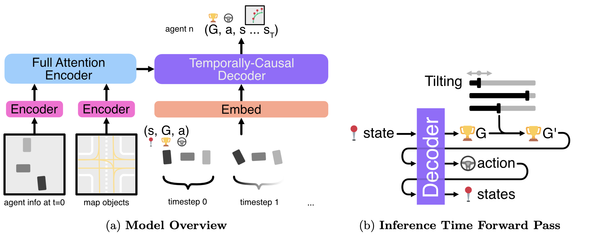

# Official Repository for CtRL-Sim (CoRL 2024)

<p align="left">
<a href="https://arxiv.org/abs/2403.19918" alt="arXiv">
    </a>
<a href="https://montrealrobotics.ca/ctrlsim/" alt="webpage">
    </a>

<a href="https://paperswithcode.com/paper/ctrl-sim-reactive-and-controllable-driving">
    </a>
<a href="https://youtu.be/oH99fd_462Q" alt="youtube">
    </a>

**[Luke Rowe*](https://github.com/RLuke22), [Roger Girgis*](https://mila.quebec/en/person/roger-girgis/), [Anthony Gosselin](https://www.linkedin.com/in/anthony-gosselin-098b7a1a1/), [Bruno Carrez](https://mila.quebec/en/person/bruno-carrez/), [Florian Golemo](https://fgolemo.github.io/), [Felix Heide](https://www.cs.princeton.edu/~fheide/), [Liam Paull](https://liampaull.ca/), [Christopher Pal](https://sites.google.com/view/christopher-pal)**

We propose *CtRL-Sim*, a framework that leverages offline reinforcement learning for controllable closed-loop multi-agent driving simulation.



Table of Contents
=================
  * [Setup](#setup)
  * [Data](#data)
  * [Training](#training)
  * [Finetuning](#finetuning)
  * [Evaluation](#evaluation)
  * [License](#license)
  * [Citation](#citation)
  * [Acknowledgements](#acknowledgements)

## Setup

Start by cloning the repository
```
git clone https://github.com/montrealrobotics/ctrl-sim
cd ctrl-sim
```

This repository assumes you have a scratch directory ```/path/to/scratch``` for storing larger files/data. If storage is not a concern, you can simply let your scratch directory be the ctrl-sim working directory.

To setup the environment, we currently provide support for Singularity.

First, ensure the project root (```/path/to/ctrl-sim```) is in your PATH. Also, make sure the ```CONFIG_PATH``` variable in ```cfgs/config.py``` and the ```dataset_root``` and ```project_root``` variables in ```config.yaml``` are set appropriately.

### Singularity Setup

We require singularity version >= 3.7.1. [Download](https://drive.google.com/drive/folders/1-HljK62CTqXK-UpYjNM_pdTcDDiVPaYm?usp=sharing) the singularity image format file ```nocturne.sif``` for creating the nocturne-compatible singularity container and place it in your scratch directory. Create the singularity container and conda environment:

```
# shell into singularity container
singularity shell -H $HOME:/home -B /path/to/scratch:/scratch --nv /path/to/scratch/nocturne.sif
cd ctrl-sim
# load conda module
source /opt/miniconda3/etc/profile.d/conda.sh
# create conda environment
conda env create -f environment.yml
conda activate ctrl_sim
# install additional packages
pip install torch_scatter -f https://data.pyg.org/whl/torch-2.2.0+cu121.html
```

### Build Nocturne

To build nocturne, run the following:
```
python setup.py develop
```

## Data

### Downloading the Nocturne dataset

First, download the pre-processed Waymo dataset for the Nocturne simulator ```nocturne_waymo``` (150 GB), which can be found [here](https://github.com/facebookresearch/nocturne). Additionally, download the pre-processed validation_interactive split of the Waymo dataset for the Nocturne simulator, ```formatted_json_v2_no_tl_valid_interactive.tar```, which can be found [here](https://drive.google.com/drive/folders/1-HljK62CTqXK-UpYjNM_pdTcDDiVPaYm?usp=sharing). These are used as evaluation scenarios for evaluating planners against CtRL-Sim adversarial agents. Place the unzipped ```formatted_json_v2_no_tl_valid_interactive``` directory inside the ```nocturne_waymo``` directory.

We assume this dataset is in your local scratch repository with the following structure:

```
/path/to/scratch/
├── nocturne_waymo/
|   └── formatted_json_v2_no_tl_train/
|   |   ├── tfrecord-00000-of-01000_108.json
|   |   ├── tfrecord-00000-of-01000_109.json
|   |   ├── ...
|   |   ├── valid_files.json
|   |   ├── valid_files_backup.json
|   |   ├── valid_files.txt
|   |   ├── invalid_files.json
|   |   ├── invalid_files.txt
|   └── formatted_json_v2_no_tl_valid/
|   |   ├── tfrecord-00000-of-00150_101.json
|   |   ├── tfrecord-00000-of-00150_102.json
|   |   ├── ... 
|   |   ├── valid_files.json
|   |   ├── valid_files.txt
|   |   ├── invalid_files.json
|   |   ├── invalid_files.txt
|   └── formatted_json_v2_no_tl_valid_interactive/
|   |   ├── tfrecord-00000-of-00150_0.json
|   |   ├── tfrecord-00000-of-00150_106.json
|   |   ├── tfrecord-00000-of-00150_109.json
|   |   ├── ... 
|   |   ├── valid_files.json
|   |   ├── invalid_files.json
```

### Downloading the Nocturne Waymo Offline RL Dataset

The preprocessed offline RL dataset for CtRL-Sim model training ```preprocess.tar``` can be found [here](https://drive.google.com/drive/folders/1-HljK62CTqXK-UpYjNM_pdTcDDiVPaYm?usp=sharing) (193 GB). Also, download the pickle file ```test_filenames.pkl``` containing the names of the test files [here](https://drive.google.com/drive/folders/1-HljK62CTqXK-UpYjNM_pdTcDDiVPaYm?usp=sharing).

We now assume this dataset is in your local scratch repository with the following structure:

```
/path/to/scratch/
├── nocturne_waymo/
|   ├── ...
├── test_filenames.pkl/
├── preprocess/
|   └── train/
|   |   ├── tfrecord-00000-of-01000_108_physics.pkl
|   |   ├── tfrecord-00000-of-01000_109_physics.pkl
|   |   ├── ...
|   └── val/
|   |   ├── tfrecord-00000-of-00150_101_physics.pkl
|   |   ├── tfrecord-00000-of-00150_102_physics.pkl
|   |   ├── ... 
|   └── val_interactive/
|   |   ├── tfrecord-00000-of-00150_0_physics.pkl
|   |   ├── tfrecord-00000-of-00150_106_physics.pkl
|   |   ├── ... 
|   └── test/
|   |   ├── tfrecord-00000-of-00150_103_physics.pkl
|   |   ├── tfrecord-00000-of-00150_108_physics.pkl
|   |   ├── ... 
```

### Generating the Nocturne Waymo Offline RL Dataset

**Warning** This step is not necessary, given that the dataset was already downloaded in the previous step. This is only needed if you wish to rebuild the dataset from scratch.

To generate the offline RL datasets for training a CtRL-Sim model, we generate the offline RL dataset in chunks, which can be parallelized across different machines:
```
# generate validation interactive dataset
python data/generate_offline_rl_dataset.py offline_rl.chunk_idx=0 offline_rl.chunk_size=25000 offline_rl.mode=val_interactive

# generate validation dataset
python data/generate_offline_rl_dataset.py offline_rl.chunk_idx=0 offline_rl.chunk_size=25000 offline_rl.mode=val

# generate train dataset
python data/generate_offline_rl_dataset.py offline_rl.chunk_idx=0 offline_rl.chunk_size=25000 offline_rl.mode=train
python data/generate_offline_rl_dataset.py offline_rl.chunk_idx=1 offline_rl.chunk_size=25000 offline_rl.mode=train
python data/generate_offline_rl_dataset.py offline_rl.chunk_idx=2 offline_rl.chunk_size=25000 offline_rl.mode=train
python data/generate_offline_rl_dataset.py offline_rl.chunk_idx=3 offline_rl.chunk_size=25000 offline_rl.mode=train
python data/generate_offline_rl_dataset.py offline_rl.chunk_idx=4 offline_rl.chunk_size=25000 offline_rl.mode=train
python data/generate_offline_rl_dataset.py offline_rl.chunk_idx=5 offline_rl.chunk_size=25000 offline_rl.mode=train
```

Next, we preprocess the offline RL dataset for efficient CtRL-Sim model training. We preprocess the dataset in chunks, which can be parallelized across different machines:
```
# preprocess val_interactive dataset
python data/preprocess_rl_waymo.py preprocess_rl_waymo.chunk_idx=0 preprocess_rl_waymo.chunk_size=25000 preprocess_rl_waymo.mode=val_interactive dataset.waymo.preprocess_real_data=True

# preprocess val dataset
python data/preprocess_rl_waymo.py preprocess_rl_waymo.chunk_idx=0 preprocess_rl_waymo.chunk_size=25000 preprocess_rl_waymo.mode=val dataset.waymo.preprocess_real_data=True

# preprocess train dataset
python data/preprocess_rl_waymo.py preprocess_rl_waymo.chunk_idx=0 preprocess_rl_waymo.chunk_size=25000 preprocess_rl_waymo.mode=train dataset.waymo.preprocess_real_data=True
python data/preprocess_rl_waymo.py preprocess_rl_waymo.chunk_idx=1 preprocess_rl_waymo.chunk_size=25000 preprocess_rl_waymo.mode=train dataset.waymo.preprocess_real_data=True
python data/preprocess_rl_waymo.py preprocess_rl_waymo.chunk_idx=2 preprocess_rl_waymo.chunk_size=25000 preprocess_rl_waymo.mode=train dataset.waymo.preprocess_real_data=True
python data/preprocess_rl_waymo.py preprocess_rl_waymo.chunk_idx=3 preprocess_rl_waymo.chunk_size=25000 preprocess_rl_waymo.mode=train dataset.waymo.preprocess_real_data=True
python data/preprocess_rl_waymo.py preprocess_rl_waymo.chunk_idx=4 preprocess_rl_waymo.chunk_size=25000 preprocess_rl_waymo.mode=train dataset.waymo.preprocess_real_data=True
python data/preprocess_rl_waymo.py preprocess_rl_waymo.chunk_idx=5 preprocess_rl_waymo.chunk_size=25000 preprocess_rl_waymo.mode=train dataset.waymo.preprocess_real_data=True
```

Next, we split the validation set into a val and test set and generate test_filenames.pkl file:

```
python data/split_val_test.py
```

### Downloading the CAT Finetuning Dataset

We finetune CtRL-Sim on a dataset of adversarial scenarios from the val_interactive split of Waymo using [CAT](https://metadriverse.github.io/cat/). The preprocessed CAT finetuning dataset for CtRL-Sim model finetuning ```preprocessed_cat.tar``` can be found [here](https://drive.google.com/drive/folders/1-HljK62CTqXK-UpYjNM_pdTcDDiVPaYm?usp=sharing) (3.8 GB). Also, download the pickle file ```eval_planner_dict.pkl``` [here](https://drive.google.com/drive/folders/1-HljK62CTqXK-UpYjNM_pdTcDDiVPaYm?usp=sharing).

We now assume this dataset is in your local scratch repository with the following structure:

```
/path/to/scratch/
├── preprocess/
|   ├── ... 
├── nocturne_waymo/
|   ├── ...
├── test_filenames.pkl/
├── preprocessed_cat/
|   ├── tfrecord-00000-of-00150_111_physics_cat.pkl
|   ├── tfrecord-00000-of-00150_134_physics_cat.pkl
|   ├── ... 
├── eval_planner_dict.pkl/
```

### Generating the CAT Finetuning Dataset

**Warning** This step is not necessary, given that the dataset was already downloaded in the previous step. This is only needed if you wish to rebuild the CAT finetuning dataset from scratch.

The first step is to follow the steps in the [CAT repository](https://github.com/metadriverse/cat) to convert the Waymo validation interactive tfrecord files into MetaDrive scenario descriptions. Make sure to replace ```cat_advgen.py``` and ```scripts/convert_WOMD_to_MD.py``` in the ```cat``` repository files with the corresponding files in ```modified_cat_files```. The Waymo validation interactive tfrecord files can be downloaded from the Waymo Open Dataset [website](https://waymo.com/open/). 


After setting up the CAT repository and replacing the necessary files, run (see [here](https://github.com/metadriverse/cat?tab=readme-ov-file#data-preparation) for context):

```
python /path/to/cat/scripts/convert_WOMD_to_MD.py --input /path/to/val_interactive/waymo/tfrecord/files --output /scratch/md_scenarios
```

Once the MetaDrive scenario files are generated, we must find the valid scenarios that overlap with the valid Nocturne files, from which we create a finetuning dataset and test set. All valid scenarios are randomized and reindexed from 0, where the first 1000 indices comprise the test set (test set for Table 2 in paper), and the remaining indices comprise the finetuning dataset. The reindexed valid scenarios are stored in ```/scratch/valid_md_scenarios```, with the corresponding metadata stored in ```/scratch/eval_planner_dict.pkl```. To generate these, run:

```
python data/filter_valid_cat_scenarios.py
```

Next, we run CAT to generate the adversarial trajectories, which will be stored in the ```eval_planner_dict.pkl``` file:

```
python /path/to/cat/cat_advgen.py --dict_path /path/to/eval_planner_dict.pkl
```

Finally, to generate and preprocess the CAT finetuning dataset, run:

```
python data/generate_offline_rl_cat_dataset.py
python data/preprocess_rl_waymo.py dataset.waymo.preprocess_simulated_data=True
```

## Training

To train a CtRL-Sim model, run:
```
python train.py
```
This will run according to the configurations specified in ```cfgs/config.yaml```. By default, this will train on 4 GPUs with a total batch size of 64. Set ```train.track=True``` to log the run to wandb, where the wandb project and entity can be configured in ```cfgs/```. The model checkpoint save directory can also be configured in ```cfgs/```, which is set to ```[save_dir]/[run_name]```. By default, it is set to ```/home/checkpoints/test```.

To train a CtRL-Sim model on 1 GPU, run:
```
python train.py train.devices=1 datamodule.train_batch_size=64 datamodule.val_batch_size=64
```
**Warning** The batch size may need to be adjusted to support 1 GPU training without running out of GPU memory, but this may affect performance.

To train a DT model on 4 GPUs, run:
```
python train.py model=dt
```

To train an IL model on 4 GPUs, run:
```
python train.py model=il
```

To train an Actions Only model on 4 GPUs, run:
```
python train.py model=trajeglish
```

To train a CTG++ model on 4 GPUs, run:
```
python train.py model=ctg_plus_plus dataset/waymo=ctg_plus_plus datamodule=ctg_plus_plus train=ctg_plus_plus
```

## Finetuning

Once the preprocessed CAT scenarios have been downloaded or generated, you can now finetune a CtRL-Sim model. To finetune a CtRL-Sim model (specified by ```run_name```), run:

```
python train.py train.run_name=[replace_with_run_name] train=ctrl_sim_finetuning dataset/waymo=ctrl_sim_finetuning
```

## Evaluation

### Multi-Agent Evaluation

To evaluate CtRL-Sim with run name ```run_name``` on multi agent simulation (Table 1) over 1000 test scenes, run:

```
python eval_sim.py eval.policy.run_name=run_name eval.eval_mode=multi_agent
```

One can also evaluate a (+10) positively-tilted CtRL-Sim model by running:

```
python eval_sim.py eval.policy.run_name=run_name eval.eval_mode=multi_agent eval.policy.veh_veh_tilt=10 eval.policy.veh_edge_tilt=10 eval.policy.goal_tilt=10
```

To evaluate a DT model with run name ```run_name```, run:

```
python eval_sim.py policy@eval.policy=dt eval.policy.run_name=run_name eval.eval_mode=multi_agent
```

To evaluate an IL model with run name ```run_name```, run:

```
python eval_sim.py policy@eval.policy=il eval.policy.run_name=run_name eval.eval_mode=multi_agent
```

To evaluate an Actions Only model with run name ```run_name```, run:

```
python eval_sim.py policy@eval.policy=trajeglish eval.policy.run_name=run_name eval.eval_mode=multi_agent
```

To evaluate a CTG++ model with run name ```run_name```, we split evaluation into 4 partitions (which can be parallelized across multiple devices) by running:

```
python eval_sim.py policy@eval.policy=ctg_plus_plus eval.policy.run_name=run_name eval.eval_mode=multi_agent eval=partitioned eval.partition=0
python eval_sim.py policy@eval.policy=ctg_plus_plus eval.policy.run_name=run_name eval.eval_mode=multi_agent eval=partitioned eval.partition=1
python eval_sim.py policy@eval.policy=ctg_plus_plus eval.policy.run_name=run_name eval.eval_mode=multi_agent eval=partitioned eval.partition=2
python eval_sim.py policy@eval.policy=ctg_plus_plus eval.policy.run_name=run_name eval.eval_mode=multi_agent eval=partitioned eval.partition=3
# TODO: missing MetricsComputer line
```

### Single Agent Tilting Evaluation

To conduct one-agent tilting evaluation (Figure 4) of a CtRL-Sim model with run name ```run_name``` over 1000 test scenes with with specified tilting values GOAL_TILT, VEH_VEH_TILT, and VEH_EDGE_TILT, run:

```
python eval_sim.py eval.policy.run_name=run_name eval.eval_mode=one_agent eval.policy.goal_tilt=GOAL_TILT eval.policy.veh_veh_tilt=VEH_VEH_TILT eval.policy.veh_edge_tilt=VEH_EDGE_TILT
```

### Planner Evaluation

To evaluate a CtRL-Sim planner (with run name ```run_name_planner```) against a finetuned CtRL-Sim adversary (with run anem ```run_name_adversary```) over 1000 test scenes (held out from Waymo validation_interactive split), run:

```
python eval_planner.py eval_planner_adversary.planner.run_name=run_name_planner eval_planner_adversary.adversary.run_name=run_name_adversary
```

To evaluate a CtRL-Sim planner (with run name ```run_name_planner```) against a CAT adversary, run:

```
python eval_planner.py eval_planner_adversary.planner.run_name=run_name_planner policy@eval_planner_adversary.adversary=cat
```

## License

Check [LICENSE](LICENSE)

## Citation

```bibtex
@inproceedings{
  rowe2024ctrlsim,
  title={Ct{RL}-Sim: Reactive and Controllable Driving Agents with Offline Reinforcement Learning},
  author={Luke Rowe and Roger Girgis and Anthony Gosselin and Bruno Carrez and Florian Golemo and Felix Heide and Liam Paull and Christopher Pal},
  booktitle={8th Annual Conference on Robot Learning},
  year={2024},
  url={https://openreview.net/forum?id=MfIUKzihC8}
}
```

## Acknowledgements

We would like to acknowledge the following public repositories:
  * [nocturne](https://github.com/facebookresearch/nocturne)
  * [AutoBots](https://github.com/roggirg/AutoBots)
  * [cat](https://github.com/metadriverse/cat)
  * [QCNet](https://github.com/ZikangZhou/QCNet)
