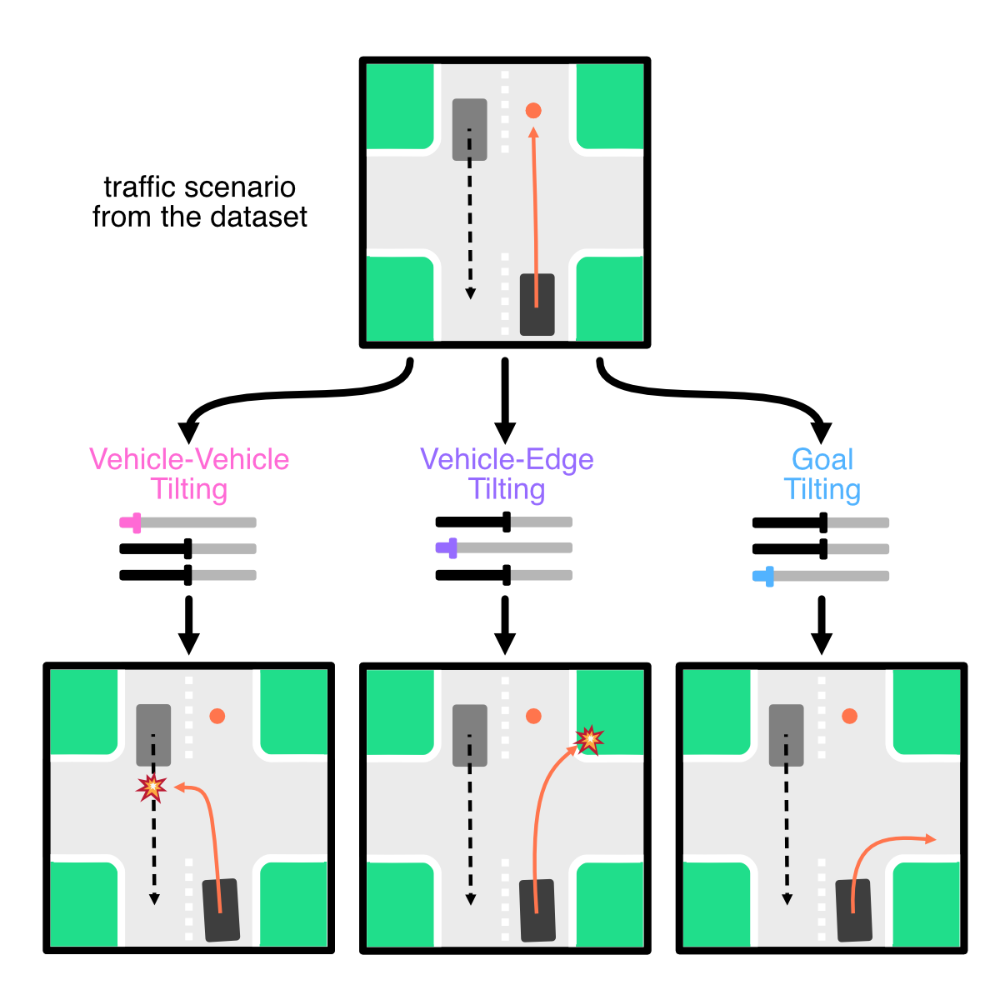

# Official Repository for CtRL-Sim

[Paper](https://arxiv.org/abs/2403.19918) | [Project Page](https://montrealrobotics.ca/ctrlsim/)

**[Luke Rowe](https://github.com/RLuke22), [Roger Girgis](https://mila.quebec/en/person/roger-girgis/), [Anthony Gosselin](https://www.linkedin.com/in/anthony-gosselin-098b7a1a1/), [Bruno Carrez](https://mila.quebec/en/person/bruno-carrez/), [Florian Golemo](https://fgolemo.github.io/), [Felix Heide](https://www.cs.princeton.edu/~fheide/), [Liam Paull](https://liampaull.ca/), [Christopher Pal](https://sites.google.com/view/christopher-pal)**

We propose *CtRL-Sim*, a framework that leverages offline reinforcement learning for controllable closed-loop multi-agent driving simulation.



**Code will be released soon.**

Table of Contents
=================
  * [License](#license)
  * [Citation](#citation)

## License

Check [LICENSE](LICENSE)

## Citation

```bibtex
@InProceedings{
  rowe2024ctrlsim,
  title={{CtRL-Sim}: Reactive and Controllable Driving Agents with Offline Reinforcement Learning},
  author={Luke Rowe and Roger Girgis and Anthony Gosselin and Bruno Carrez and Florian Golemo  and Felix Heide and Liam Paull and Christopher Pal},
  journal={arXiv},
  volume={2403.19918},
  year={2024}
}
```
